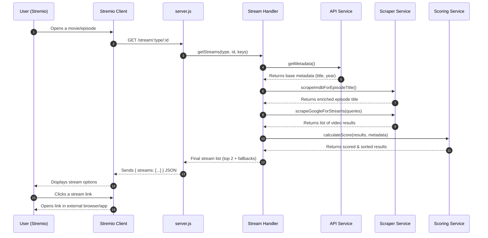

# Tube Search — Stremio Add-on 🚀

A Stremio add-on that finds playable links by scraping **IMDb, TMDb and OMDB for accurate metadata** and searching multiple video platforms. It builds context-aware queries, scrapes Google for results, ranks them with an intelligent scoring algorithm, and presents safe, external links inside Stremio.

---

## ✨ Features

*   **Accurate Metadata:** Uses **IMDb scraping** as the primary source for episode titles, ensuring the most accurate search queries. Falls back to TMDb/OMDb APIs and also leans on them for metadata except episode titles.
*   **Intelligent Scoring:** Ranks results using a flexible algorithm that considers:
    *   **Google's Own Ranking:** Gives a bonus to the top results from Google.
    *   **Word-based Title Matching:** Smartly compares titles by word overlap, ignoring minor punctuation differences.
    *   **Duration Matching:** Prioritizes videos with a runtime close to the official one.
*   **Multi-source Discovery:** Scrapes Google's video search, which indexes YouTube, Dailymotion, Vimeo, and Archive.org for candidate streams.
*   **External-only Links:** Streams are exposed with `behaviorHints.externalUrl=true` so playback opens in a browser or native app (no proxying).
*   **Resilient Fallback:** If scraping fails or no result scores high enough, the add-on provides fallback Google search links so the user is never left with a dead end.
*   **Self-serve Configuration UI:** A simple `/configure` page generates the exact Stremio install URL with embedded TMDb/OMDb keys for maximum client compatibility.

---

## 🧩 How it works (high level)

1.  **Stremio requests streams** at `/stream/:type/:id`. The request is passed to the central Stream Handler.
2.  **Fetch Metadata:** The handler calls the **API Service** to fetch base metadata (title, year, runtime) from TMDb/OMDb in parallel.
3.  **Enrich Episode Data:** For series, the handler then calls the **Scraper Service** to scrape the official IMDb episodes page for the exact episode title, ensuring the highest data quality.
4.  **Build Search Queries** based on the rich metadata. For series, it creates two queries: one with the episode number and one with the episode number and title.
5.  **Scrape Google:** The Scraper Service executes the queries against Google's video search and returns a clean, de-duplicated list of potential video links.
6.  **Score and Rank:** The **Scoring Service** is called with the metadata and scraped results. It calculates a confidence score for each result.
7.  **Produce Stream List:** The handler selects the top two highest-scoring results and formats them into a Stremio `streams[]` array. It always appends fallback Google search links as well.
8.  **Client shows options; user clicks**; the link opens externally in a browser or the appropriate app.

---

## 🛠️ Installation

### Option A — One-click from the config UI

1.  Open the hosted `/configure` page.
2.  Enter **TMDb** and **OMDb** API keys.
3.  Click **Generate Install URL** → press **Install Tube Search Add-on**. Stremio will pick up the manifest automatically.

### Option B — Manual add in Stremio

*   Copy the generated **manifest URL** (pattern below) and paste it into **Add-ons → My Add-ons → Install Add-on**:

    ```
    https://<your-host>/tmdb=<TMDB_KEY>|omdb=<OMDB_KEY>/manifest.json
    ```

    The config UI shows this URL verbatim and pre-fills from path segments when present.

> **Upgrade note:** To ensure you get the latest version, it's best to uninstall the previous version of the add-on from Stremio before installing the new one.

---

## ▶️ Using the add-on

*   Open any movie/series in Stremio; you’ll see entries for the top two results found.
*   You will also see fallback search links like:
    *   **🔍 No Title: See all results on Google...** (for episodes, a generic search)
    *   **🔍 With Title: See all results on Google...** (a more specific search if an episode title was found)
*   Clicking a result opens the external page/app; nothing is streamed through the add-on server.

---

## 📦 API / Routes

*   `GET /:configString/manifest.json` — Manifest with add-on definition for Stremio clients; `configString` carries TMDb/OMDb keys.
*   `GET /:configString/stream/:type/:id.json` — Main stream handler returning `{ streams: [...] }`.
*   `GET /configure` (and `/:configString/configure`) — Interactive installer/generator UI.

---

## 🧰 Development

### Tech stack & deps

*   **Web Server:** Node.js + Express
*   **Services:**
    *   **Metadata:** `axios` for TMDb/OMDb API calls.
    *   **Scraping:** `axios` + `cheerio` for IMDb and Google scraping.
*   **Stremio Integration:** `stremio-addon-sdk`

### Run locally

```bash
npm install
npm start
```

The application is now built with a modular, service-oriented architecture. `server.js` is a lean web layer, and all the business logic is cleanly organized in the `src` directory.

### Docker (example)

A `Dockerfile` is included to containerize the service for easy deployment.

---

## 🔐 Configuration & keys

*   **TMDb** and **OMDb** keys are embedded in the installation path (`/:configString/...`) for broad client compatibility (e.g., Android, AIOStreams). Use the `/configure` page to generate the correct URL.
*   All internal settings, such as scoring weights and CSS selectors, are managed in the central `src/config.js` file.

---

## 🧭 Mermaid – End-to-End Flow (Refactored Architecture)



---

## 📁 Project structure (Refactored)

```
.
└── Tube-Search-main/
    ├── src/
    │   ├── api-service.js        # Handles TMDb/OMDb API calls
    │   ├── config.js             # Central configuration for the whole app
    │   ├── scraper-service.js    # Handles all IMDb and Google scraping
    │   ├── scoring-service.js    # Contains the intelligent scoring logic
    │   └── stream-handler.js     # Orchestrates the services to produce streams
    ├── public/
    │   └── configure.html
    ├── server.js                 # Lean Express server (routes only)
    ├── manifest.json
    ├── package.json
    └── Dockerfile
```

---

## 🤝 Contributing

Issues and PRs are welcome—improvements to scraping robustness, scoring, and provider coverage are especially valuable.

---

## 📜 License

MIT.
