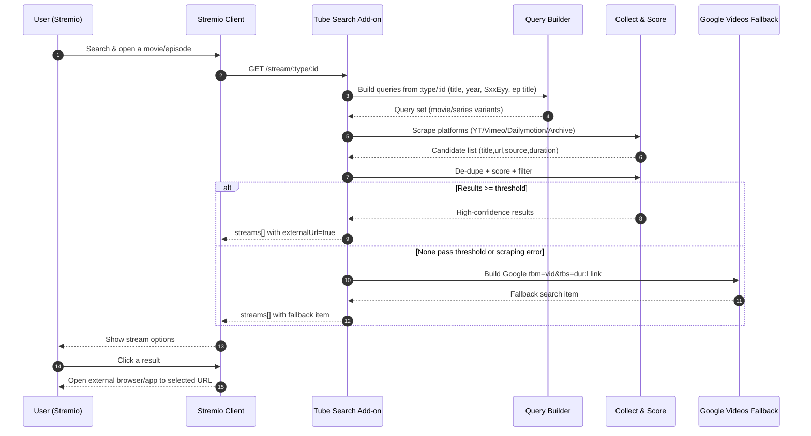

# Tube Search — Stremio Add-on 🚀

A Stremio add-on that finds playable links by **searching multiple video platforms** and presenting **safe external links** inside Stremio. It builds context-aware queries (movie vs. episode), scrapes results, ranks them, and falls back to a Google “Videos” search when needed. All links open externally (browser/app).  &#x20;

---

## ✨ Features

* **Multi-source discovery:** Scrapes YouTube, Dailymotion, Vimeo, and Archive.org for candidate streams.&#x20;
* **Context-aware queries:**

  * Movies: `"Title [Year] full movie"` → Google Videos filter.&#x20;
  * Series: `"Title SxxEyy"` and, when available, `"Title SxxEyy EpisodeTitle"` variants. &#x20;
* **Result scoring & filtering:** Collects candidates, de-dupes, scores by match/duration, and only keeps high-confidence results; otherwise falls back cleanly. &#x20;
* **External-only links:** Streams are exposed with `behaviorHints.externalUrl=true` so playback opens in a browser/app (no proxying).&#x20;
* **Resilient fallback:** If scraping fails or no result passes the threshold, adds a **Google “Videos/Long”** search shortcut. &#x20;
* **Self-serve configuration UI:** `/configure` page generates the exact Stremio install URL with embedded TMDb/OMDb keys for client compatibility. &#x20;

---

## 🧩 How it works (high level)

1. **Stremio requests streams** at `/stream/:type/:id`. The server parses `:type` (`movie` or `series`) and the Stremio ID, then calls `getStreamsForContent`.&#x20;
2. **Build search queries** from metadata (title/year for movies; title/season/episode and optional episode title for series).  &#x20;
3. **Scrape multiple platforms**; collect `{title,url,source,duration}` items, de-duplicate, and compute confidence scores. &#x20;
4. **Produce stream list:**

   * When scored results exist → map to Stremio `streams[]` with external links.&#x20;
   * If none pass → add a **Google “Videos (dur\:l)”** search link as graceful fallback. &#x20;
5. **Client shows options; user clicks**; the link opens outside Stremio (browser/YouTube app).&#x20;

---

## 🛠️ Installation

### Option A — One-click from the config UI

1. Open the hosted `/configure` page.&#x20;
2. Enter **TMDb** and **OMDb** API keys.&#x20;
3. Click **Generate Install URL** → press **Install Tube Search Add-on**. Stremio will pick up the manifest automatically.&#x20;

### Option B — Manual add in Stremio

* Copy the generated **manifest URL** (pattern below) and paste in **Add-ons → My Add-ons → Install Add-on**:

  ```
  https://<your-host>/tmdb=<TMDB_KEY>|omdb=<OMDB_KEY>/manifest.json
  ```

  The config UI shows this URL verbatim and pre-fills from path segments when present. &#x20;

> **Upgrade note:** If the install URL format changed, uninstall the previous add-on first to avoid duplicates/conflicts.&#x20;

---

## ▶️ Using the add-on

* Open any movie/series in Stremio; you’ll see additional entries like:

  * **Search (Videos)** for episodes — generic and “with title” variants. &#x20;
  * **Search (Long videos)** for movies (prefers full-length).&#x20;
* Clicking a result opens the external page/app; nothing is streamed through the add-on server.&#x20;

---

## 📦 API / Routes

* `GET /:configString/manifest.json` — Manifest with add-on definition for Stremio clients; `configString` carries TMDb/OMDb keys.&#x20;
* `GET /stream/:type/:id` — Main stream handler returning `{ streams: [...] }`.&#x20;
* `GET /configure` (and `/CONFIG/configure`) — Interactive installer/generator UI.&#x20;

---

## 🧠 Stream generation details

* **Movies:** Builds `"Title [Year] full movie"` and a Google Videos link with `tbm=vid&tbs=dur:l` (long videos).&#x20;
* **Series:** Builds **two** variants when episode title exists:

  * Generic `"Title SxxEyy"`;
  * Specific `"Title SxxEyy EpisodeTitle"`;
    Each uses the same Google Videos filter. &#x20;
* **Scraping & scoring:** Aggregates results from target platforms, ensures uniqueness, extracts durations/titles, and scores them; if no item surpasses the threshold, triggers fallback.  &#x20;
* **Always-visible search escape hatch:** Even on success paths, the code appends a “See all results on Google” item (UX affordance).&#x20;

**Returned stream shape (example):**

```json
{
  "title": "[YouTube] Cleaned Title\nDuration: 1:45:00",
  "externalUrl": "https://…",
  "behaviorHints": { "externalUrl": true }
}
```

All streams are marked external to ensure lawful client-side playback.&#x20;

---

## 🧰 Development

### Tech stack & deps

* Node.js + Express server, scraping via **axios** + **cheerio**, Stremio integration via **stremio-addon-sdk**.&#x20;

### Run locally

```bash
npm install
npm start
# server.js is the entrypoint
```

`server.js` loads the manifest, config parsing, and route handlers. &#x20;

### Docker (example)

A minimal Dockerfile is included to containerize the service for deployment.&#x20;

---

## 🔐 Configuration & keys

* **TMDb** and **OMDb** keys are embedded in the installation path (`/:configString/…`) for broad client compatibility (e.g., Android, AIOStreams) that require `/manifest.json` URLs. Use the `/configure` page to generate correctly. &#x20;

---

## ⚠️ Limitations & notes

* **No direct streaming/proxying:** Links open externally; quality/availability depends on the source site.&#x20;
* **Scraping fragility:** If selectors/layouts change on third-party sites, the add-on falls back to Google Videos search. &#x20;
* **Duplicates/Noise:** De-duplication is applied, but some noise may still appear; the fallback entry remains as a quick “see all results” escape. &#x20;

---

## 🧭 Mermaid – end-to-end flow



---

## 📁 Project structure

```
.
└── Tube-Search/
    ├── manifest.json
    ├── package.json
    ├── public/
    │   └── configure.html
    └── server.js
```

Entry points, routes, and UI are implemented in these files.&#x20;

---

## 🤝 Contributing

Issues and PRs are welcome—improvements to scraping robustness, scoring, and provider coverage are especially valuable. (The `/configure` page is also a great place to add validation UX.)&#x20;

---

## 📜 License

MIT.&#x20;

---

### Appendix — Key code references

* Stream handler & controller wiring (routes):&#x20;
* External stream mapping + titles/durations:&#x20;
* Google fallback (both movie/series):   &#x20;
* Scraping & candidate capture (cheerio selectors, de-dupe):&#x20;
* Config UI generation & prefill:&#x20;
* Dependencies & entry script:&#x20;
